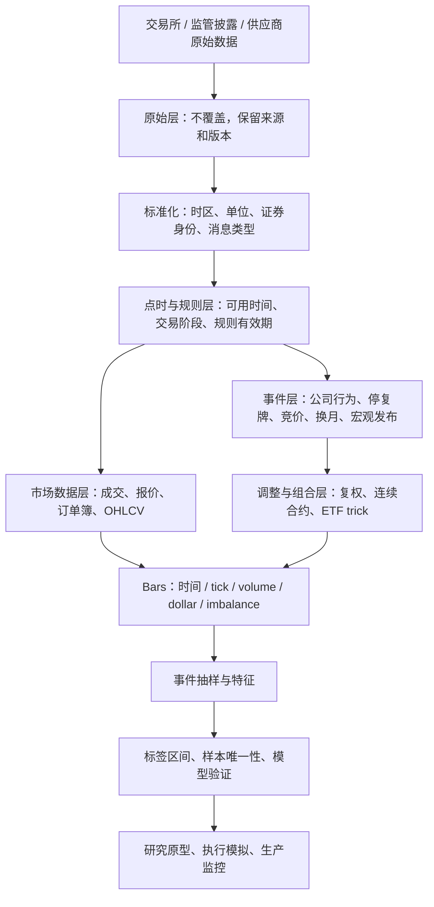

<div align="center">

# A股与美股金融数据整理实务手册

**A 股与美股金融数据整理、点时数据（point-in-time data）工程与量化研究实务**

从原始市场记录到可复现、可审计、可用于回测与交易研究的数据流水线。

</div>

> **英文摘要（English summary）：** A data-engineering handbook for A-share and U.S. financial research, centered on point-in-time correctness, historical security identity, disclosure availability, revisions, corporate actions, and auditable datasets. Current database values are not assumed to have been historically available.

> [!IMPORTANT]
> 本仓库强调 **点时正确性（point-in-time correctness）**：今天数据库中存在的数据，不代表历史决策时点已经可见。所有训练、回测和事件研究都应以当时真实可用的信息集为边界。

## 章节导航

- [核心原则](#0-总原则数据是当时可见的市场状态)
- [底层架构](#1-底层架构时间证券身份和版本)
- [A股与美股市场机制](#2-a股与美股相同的整理逻辑不同的市场机制)
- [数据类别与整理方法](#3-数据类别及各自整理方法)
- [金融事件与 Bars](#4-从金融事件到-bar推导与选型)
- [实务化代码](#5-书中方法的实务化代码)
- [统计问题](#6-采样之后的统计问题整理不会自动解决)
- [生产数据质量](#7-生产数据质量从字段检查到经济检查)
- [完整研究流程（pipeline）](#8-从原始数据到可用样本的流水线)
- [A股与美股检查清单](#9-a股与美股的实务检查清单)

---

## 建议的数据工程分层（结构示意）

> 下列目录是数据工程项目的建议组织方式，仅作概念示意；其中的代码、数据、测试和许可文件不代表本仓库已经提供。本仓库内的实际文档清单以根目录 README 为准。

```text
financial-data-engineering-handbook/
├── README.md
├── docs/
│   ├── market-structure/
│   ├── point-in-time/
│   ├── corporate-actions/
│   ├── sampling-and-bars/
│   └── data-quality/
├── examples/
│   ├── point_in_time_adjustment.py
│   ├── activity_bars.py
│   ├── cusum_filter.py
│   ├── futures_roll.py
│   └── basket_wealth.py
├── data/
│   └── README.md
├── tests/
├── LICENSE
└── .gitignore
```

---

## A股与美股金融数据整理实务手册
> [!NOTE]
> **目标**：把原始市场记录整理成在指定决策时点真实可得、经济含义明确、能够映射到实际交易过程的数据。
>
> **范围**：A股和美国股票市场；兼顾日频、分钟、逐笔成交、报价、订单簿、财报、公司行为、宏观与另类数据。
>
 > **规则核对时点**：2026-09-28。规则会变，生产系统必须保存版本和生效区间。
>
> **资料基础**：结合 Marcos López de Prado《Advances in Financial Machine Learning》第1、2、4、5、17、19章的数据结构和研究流程，并补充 A股与美股实务。

---

## 0. 总原则：数据是“当时可见的市场状态”

金融数据不能只用“证券代码 + 日期 + 收盘价”描述。对任意模型决策点，至少应能回答：

1. **哪一个经济实体、哪一种证券？** 公司、普通股、ADR、ETF、期权和期货不能混为一谈。
2. **记录描述何时发生？** 报告期、公告时间、成交时间、交易所接收时间、供应商接收时间各不相同。
3. **当时能否看见？** 公开时间、传输延迟和数据修订历史影响可用性。
4. **当时能否成交？** 价格可能来自停牌、集合竞价、盘后、不可成交报价或错误修正。
5. **一行代表什么观察？** 固定钟表时间、固定成交笔数、固定成交量、固定成交金额或事件触发。
6. **经过什么变换？** 原始价、拆股调整价、总回报价、换月调整价、标准化特征都要可追溯。
7. **记录从何而来？** 来源、授权、版本、处理代码、校验结果和更新时间都应保留。

可将用于训练或交易的一条记录表示为：

  sample<sub>i</sub> = (instrument<sub>i</sub>, event_time<sub>i</sub>, known_time<sub>i</sub>, observation_rule<sub>i</sub>, value<sub>i</sub>, lineage<sub>i</sub>)

其中 event time 是事实发生时间，known time 是策略最早可以知道该事实的时间，lineage 是原始来源及变换链。决策时点 t 只能使用 known time 不晚于 t 的数据。

**最根本的错误**，是把“今天数据库里有这个值”误当成“当时市场已经知道这个值”。点时正确性（point-in-time correctness）比数据表整齐更重要。

---

## 1. 底层架构：时间、证券身份和版本

### 1.1 时间字段至少分四类

不要只保留一个含义不明的 date。

| 字段 | 含义 | 例子 | 用途 |
|---|---|---|---|
| event_time | 市场事件或经济事实发生时间 | 撮合时间、宏观统计所属期 | 排序和还原市场过程 |
| published_at | 信息对公众公布的时间 | 财报公告、宏观数据发布日期 | 防止前视偏差 |
| received_at | 供应商或本系统收到的时间 | 行情网关接收时间 | 延迟分析和可用性判断 |
| available_at | 策略实际可消费的时间 | 发布时刻加供应商和系统处理延迟 | 点时回测和信号生成 |
| valid_from / valid_to | 某版本在现实中生效的区间 | 公司行业分类、证券状态 | 处理分类和身份变更 |
| recorded_at | 本数据库写入或修订时间 | 入库时间 | 审计和纠错 |

原始层同时保存交易所当地时间与 UTC；分析层统一使用 UTC，展示层再转换为当地时间。A股不采用夏令时；美国交易所使用美东时间，夏令时切换会改变它与 UTC 的偏移。不能把“美东 9:30”永远写成同一个 UTC 小时。

有发布延迟的数据可构造：

$$
	ext{available_at} =
max(	ext{公开发布时间}, 	ext{本策略实际收到时间}) + 	ext{决策安全延迟}
$$

历史回测若没有可用时间记录，至少使用公告时间和保守延迟，并将假设写入数据版本。盘后公告不能进入公告前的盘中决策。

### 1.2 证券身份不要用 ticker 单独充当主键

Ticker 会变更、复用，或在不同交易所重复。建议拆成：

- issuer_id：发行人身份；
- security_id：具体证券身份，例如普通股、ADR、不同投票权股份；
- listing_id：上市地点和挂牌证券；
- symbol：带有效区间的展示代码；
- exchange / venue：交易所、交易场所或报告场所；
- currency、price_scale、share_multiplier、contract_multiplier；
- valid_from / valid_to：标识组合生效区间；
- security_type、board、risk_status、trading_status。

A股需保留交易所、板块、证券类别、风险警示、停复牌和上市状态；美股需区分普通股、ADR、不同股类、ETF、OTC证券，并保留发行人映射。退市证券也要留在历史证券主表中，不能只保存今天仍上市的股票。

### 1.3 建议的数据分层

```text
data/
  raw/             原始不可变数据，按 source/date/instrument 分区
  normalized/      统一字段、单位、时区和身份映射后的数据
  point_in_time/   有版本和可用时间的基本面、分类数据
  market_events/   停牌、集合竞价、公司行为、换月、宏观发布等事件
  bars/            时间/成交笔数/成交量/成交额/事件柱（time/tick/volume/notional/event bars）
  features/        特征矩阵及其生成版本
  quality/         缺失、重复、序列缺口、异常和修复记录
  manifests/       来源、授权、校验、代码版本、规则版本
```

处理链应可重放：原始文件只追加、不覆盖；修订值作为新版本写入；每个产物记录源文件哈希、生成时间、代码版本、参数、市场日历版本和证券主表版本。这样才能说明某次历史回测具体使用了哪批数据。

---

## 2. A股与美股：相同的整理逻辑，不同的市场机制

两地数据都需要处理时区、公司行为、停牌、报价质量、幸存者偏差和供应商修订；主要差异在交易机制、场所结构和可交易性约束。以下规则截至 2026-09-28 核对。

| 维度 | A股实务重点 | 美股实务重点 | 对数据整理的影响 |
|---|---|---|---|
| 交易场所 | 沪、深、北交所及板块规则需要分别映射；交易所集中竞价和盘后机制明确 | 多个交易所、ATS 和场外内部化共同构成市场，交易分散 | A股数据保留市场/板块规则；美股区分 direct feed、SIP/综合行情、场外成交和各 venue |
| 核心交易时段 | 上交所 2026 规则列出 9:15–9:25 开盘集合竞价、9:30–11:30 与 13:00–14:57 连续竞价、14:57–15:00 收盘集合竞价；2026-07-06 起盘后固定价格交易范围扩展至全部 A股和 ETF，盘后阶段为 15:05–15:30 | Nasdaq 普通交易时段为 9:30–16:00 美东时间；其盘前、盘后为 4:00–9:30、16:00–20:00，实际可交易时段受 venue 和经纪商支持影响 | 每笔记录带 session 和 auction_type；不要把盘前/盘后、集合竞价和连续竞价拼成一种流动性 |
| 同日买卖与交收 | A股股票买入后通常需交收前不能卖出，存在股票 T+1 回转限制；其他品种可能有不同回转规则 | 美国多数适用证券自 2024-05-28 起采用 T+1 标准交收，但这是交收周期，不等于禁止当日买入后卖出 | 分开建模 trade_date、settlement_date、sellable_at。不要把“交收 T+1”误写成“不能日内回转” |
| 涨跌与停牌 | 按交易所、板块、证券状态和规则版本分别配置涨跌幅与无涨跌幅情形。上交所 2026 规则将主板风险警示股票涨跌幅调整为 10%；上市首日等特定情形不设涨跌幅限制 | 没有与 A股同类的普遍个股每日固定涨跌幅，但有市场级熔断、个股停牌和 Limit Up-Limit Down 等机制 | 保存限制价格、状态、停牌、复牌和规则版本；触板不代表一定能成交，回测需考虑排队和不可成交 |
| 报价单位 | A股股票通常以人民币分为报价单位；证券类别和规则版本仍需查验 | 美股报价单位、盘中报价规则和证券价格档位有专门规范，历史规则也可能变更 | 不要先把价格四舍五入到统一精度；保存原始精度和适用 tick-size 规则 |
| 开盘/收盘 | 集合竞价形成开盘价和收盘价；盘后固定价格成交以收盘价为基准 | NYSE、Nasdaq 等各有开收盘 auction 和 imbalance feed，规则与时间不完全相同 | 单独保存竞价指示价、未匹配量、竞价成交和连续交易成交；注明日收盘价定义 |
| 报价覆盖 | 交易所内订单簿较集中，但须区分交易所行情、深度档位、盘后固定价格和大宗交易 | SIP 提供综合行情视图，交易所 direct feed 可包含各自更详细的队列数据；两者不是同一数据集 | 研究 NBBO、全市场执行或队列位置时明确数据覆盖；不能拿单一 venue 的 L2 代表全美订单簿 |
| 公司行为 | 分红、送转、配股、增发、限售解禁、停复牌、风险警示、退市整理等需单独建表 | 拆股、现金/特别分红、spin-off、合并、ADR 比率变化、ticker/CUSIP 变化、停牌/退市等需单独建表 | 统一事件模型，同时保留本地市场事件类型和业务含义 |

> **规则维护要求**：规则表至少包含 market、security_type、board、effective_from、effective_to、source_url、version。2026年沪深交易所规则调整说明了旧参数可能过期：历史重放按历史有效规则应用涨跌幅、交易阶段和申报处理，不能把现行机制回填到过去。

### 2.1 A股交易时段要成为数据字段

可统一定义：

```text
PRE_OPEN_CALL / OPEN_CALL / CONTINUOUS_AM / LUNCH_BREAK
CONTINUOUS_PM / CLOSE_CALL / AFTER_HOURS_FIXED_PRICE
HALTED / RESUMPTION_AUCTION / SPECIAL_SESSION
```

不要仅靠钟表时间切割。集合竞价中的申报、撤单和虚拟撮合信息，与连续竞价成交不是同一种观察。午间没有连续撮合；盘后固定价格虽以收盘价撮合，也不是收盘前的连续竞价。不同品种、板块和规则版本还要分别校验。

### 2.2 美股要区分“综合市场”和“单一场所”

美国股票不是一张完整的订单簿。根据研究目的选择数据层：

- **SIP/综合行情**：观察综合报价、成交和公开市场总体状态；仍需理解字段、延迟和成交报告条件。
- **交易所 direct feed**：分析某一交易所的逐笔订单、队列和撮合；不是全美市场深度。
- **场外成交报告**：补充已执行成交；通常不能还原未成交订单队列。
- **经纪商成交回报**：用于真实执行分析，应保留 venue、订单生命周期、费用和成交条件。
- **盘前/盘后**：流动性通常较薄，报价较宽；与核心时段分开建模。

截至本手册核验日（2026-09-28），Nasdaq 仍以 4:00–20:00 ET 为现行日间系统时段，核心交易为 9:30–16:00 ET；Nasdaq 已公告计划于 2026-12-06 增加 21:00–次日 4:00 ET 夜间场次。这个安排是将来生效的交易时段扩展，需等实际启用并核对 SIP/经纪商覆盖后再纳入真实历史数据，不能把它写入此前的交易日历。不同交易场所和券商的扩展时段并不等价。

SEC 市场结构资料描述了美国市场的分散场所结构，也按交易所发布 odd-lot、hidden-volume、取消率等统计。对美股微观结构研究，数据覆盖范围会直接决定结论成立的边界。

---

## 3. 数据类别及各自整理方法

### 3.1 日线与分钟 OHLCV

#### 用途

日线常用于中低频选股、风控、因子研究和组合回测；分钟线用于日内策略、开收盘效应和执行分析。

#### 先分清 raw、前复权、后复权和总回报

- **Raw / 未复权价**：当时真实的市场报价或成交价格。用来模拟下单、成交、限价、止损、保证金和执行成本。
- **前复权价（常见中文行情口径）**：以某个最新锚点（通常是当前末日）为基准，把更早的历史价格按后续除权除息因子向过去调整；末日价格通常与末日 raw close 接近或相同。前复权图上的历史价格会因后来发生的分红、送转、拆股而改变。
- **后复权价（常见中文行情口径）**：以早期历史价格为锚点，把除权除息日之后的价格向未来累计调整，表示把权益按供应商假设再投资后的累计价格路径。后复权末端价格通常不等于市场真实报价。
- **拆股调整价**：只把拆股、合股等股数变化换到同一股数口径；不一定包含现金分红。
- **总回报序列**：把现金分红、拆股以及适用的其他分配按明确假设纳入持有期收益。它是收益度量，不是实际成交价。

“前复权”“后复权”是中国行情软件的常见叫法，但不同供应商可能在现金分红、配股、送转、特别分红和精度处理上采用不同规则。美股数据常见 adjusted close 字段，也应查清究竟包括拆股、普通/特别分红、spin-off 等哪些事件。不能只凭字段名称假定口径一致。

#### 前复权与后复权的因子关系

设某次公司行为的前一日收盘价为 P_prev，除权除息参考价为 P_ex_ref，则该事件的价格比例因子为：

    a_e = P_ex_ref / P_prev

在只处理拆股时，如果 1 股旧股变成 k 股新股，则 a_e = 1/k。现金分红的简化例子中，若前收盘价为 100、每股现金分红为 2，则 P_ex_ref 约为 98，a_e 约为 0.98。实际除权参考价应采用交易所或公司行为数据源的正式口径；配股、送转与多种权益同时发生时，不要用这个简化式硬算。

以前复权锚点 T 表示：

    前复权价(t; T) = raw价(t) × 所有满足 t < 除权日(e) ≤ T 的 a_e 之积

以事件前 raw 价 100、现金分红 2 为例，事件前历史价格乘 0.98，调整到 98；最新端仍以最新 raw 价为锚。因此，如果后来又发生新的公司行为，新的因子会继续改变更早历史段的前复权价格。

后复权可以理解为反向累计：

    后复权价(t) = raw价(t) × 所有满足 除权日(e) ≤ t 的 (1/a_e) 之积

在同一个 100 元、分红 2 元的简化例子里，事件后的 raw 价乘约 1/0.98，连接到事件前的原始价格尺度。若是 1 股拆成 2 股，拆股后价格乘 2，早期历史价格保持原尺度。实际供应商可能使用不同锚点、分红再投资假设和四舍五入方法，比较数据前要先统一约定。

#### 哪种口径用于什么任务

| 任务 | 优先使用的数据 | 原因 |
|---|---|---|
| 下单、成交模拟、限价、止损、仓位和资本占用 | raw 价格 + 当时有效的公司行为/交易规则 | 调整价不是当时可成交价格，且涨跌停、报价和订单都按 raw 价格运行 |
| 看历史走势、计算拆股连续的技术指标 | 明确口径的拆股调整价；常见图表会用前复权 | 避免拆股造成的机械跳价；若使用绝对价格阈值，需知道历史价格会被后续事件重写 |
| 计算含现金分红的持有期收益、比较长期财富增长 | 总回报收益或总回报指数 | 现金分红是投资者收益的一部分；仅调整拆股会漏掉现金收益 |
| 比较今天锚定的历史价格形态 | 前复权 | 末端通常接近当前 raw 价，阅读和部分价格形态分析直观 |
| 从初始本金观察累计再投资财富路径 | 后复权/总回报指数 | 把后续权益累积到未来端，更接近假设再投资后的财富指数 |
| 复现历史时点的模型输入 | 当时有效版本的点时复权序列，或 raw 价格加已生效公司行为自行计算 | 避免把未来公司行为因子带入当时特征 |

前复权和后复权通常在相邻时点的回报率上给出相近的连续性，但**价格水平不同**。对使用价格比率、收益率、排序的算法，常数尺度变化可能无影响；对使用绝对价格、固定价位、最小价格门槛、整数价格单位或以价格为输入的神经网络，尺度变化可能影响结果。对于训练/回测，必须在每个历史决策日只应用当时已经生效、且当时可知的公司行为版本。

**拆股时还要同步处理数量口径。** 若 1 股变成 k 股，把历史成交量换到拆股后股数口径通常要乘 k；价格乘 1/k，两者乘积对应的成交金额不变。若使用供应商调整成交量，要核对其调整方向。始终保留原始成交量，不要用调整量覆盖原始记录。

现金分红的简化总回报公式为：

    每股持有期总回报 = (期末价格 + 现金分红 + 其他权益价值) / 期初价格 - 1

若期间发生拆股，设每 1 股期初持股在期末对应 k 股，且每股现金权益按期初持股口径计为 D，则：

    总回报 = (k × 期末raw价 + D + 配发权益价值) / 期初raw价 - 1

这只是帮助理解的总回报核算式。配股、spin-off、税费、现金替代、特殊分红、复投时间和 ADR 比率变化都需要按事件条款分别处理。

#### 后复权究竟何时用：按任务选口径

**后复权适合回答“如果从某个早期时点持有，并按数据口径把分配权益接续到价格路径上，财富曲线怎样变化”这一类回顾性问题。** 典型用途是长期走势图、跨越拆股和分红的历史累计表现展示，以及把各证券从指定基期归一化后比较长期增长。它的纵轴是合成的调整价格或财富代理，不能直接解释成历史上某天真实成交过的价格。

后复权通常把起始端锚在早期价格，并把公司行为之后的价格按因子向未来累乘。设事件比例因子 a_e = 除权参考价 / 事件前价格，则在事件只影响价格、供应商口径一致的简化条件下：

    后复权价(t; t0) = raw价(t) × 所有满足 t0 < 除权日(e) ≤ t 的 (1 / a_e) 之积

若 1 股拆为 2 股，事件后 raw 价格大致减半，后复权会把事件后的价格乘 2，使序列回到事件前的价格尺度。若每股现金分红为 2 元、事件前收盘约 100 元，除息参考价约 98 元，则简化因子 a_e 约为 0.98，事件后的价格会乘约 1/0.98。该连接方式近似反映分红继续投资的累计效果，但实际回报仍取决于除息参考价算法、再投资时点、税费、费用、配股和特殊分配等条款；不能仅凭字段叫“后复权”就把它当成账户级净收益。

| 研究问题 | 后复权是否合适 | 推荐口径与原因 |
|---|---|---|
| 回看单只股票多年累计走势，展示分红与拆股后的连续财富形态 | 合适，前提是已核验供应商事件与因子定义 | 后复权，或从 1.0 起算的总回报指数；标注起始日、分配再投资、税费与币种假设 |
| 比较多只股票的长期累计表现 | 可以用于图形比较，不能直接比较未经归一化的价格水平 | 把每条序列在共同基期归一化为 1 或 100；使用可比的总回报口径并处理存续偏差 |
| 计算策略含分红的持有期收益或基准总回报 | 有条件可用 | 首选 raw 价格、持仓股数和公司行为现金流逐日记账；若用后复权收益，须验证它与事件账本及复投假设一致 |
| 模拟下单、成交、限价单、止损单、涨跌停、买入股数、资金占用 | 不合适 | raw 可交易价格、适用交易规则和真实公司行为；复权价格从未必在当日市场出现 |
| 回测价格绝对值因子、固定价格门槛、价位止损，或按 raw 价格估算市值 | 不合适 | 用当日 raw 价格和 point-in-time 股数/股本；后复权会把价格水平改写 |
| 仅使用收益率、价格比或归一化趋势形态的历史特征 | 不要直接默认合适 | 先定义特征要预测 raw price move 还是总回报；前复权和后复权在公司行为附近可能把价格收益改成含分配的连续收益，必须确认这正是研究目标 |
| 研究某历史决策日实际可见的模型输入 | 要核验锚点与历史版本，不能一概而论 | 以当前末日为锚的前复权会把未来公司行为反向改写过去；固定早期锚点的后复权通常只在事件生效后向未来累积，但应使用当时版本的事件因子，并检查供应商是否重定义锚点或事后修订 |

**最易混淆的三件事：**（1）后复权价格水平是回顾性合成坐标；（2）总回报是收益率定义，须说明现金分红是否复投及复投时点；（3）账户净盈亏是按实际成交、持仓股数、现金到账、税费、汇率和交易费用核算。三者相关，但不能互换。对于跨境持仓、ADR、配股、分拆上市或现金替代，直接按事件现金流重放更可靠。

**OHLCV 的调整也必须成套核对。** 若 1 股变为 k 股，换成事件后股数单位时，事件前历史价格乘 1/k、事件前成交量乘 k；若把事件后的数据换回旧股单位，方向相反。现金股息会改变价格/总回报口径，但不会按拆股规则缩放成交量。成交金额一般应从 raw price × raw quantity 计算并与供应商字段对账，不能把股息因子机械地套到 volume 或 turnover。原始价格、原始股数、因子和调整后序列要分别保存。

**复权因子的生产治理：**保存 corporate_action_id、类型、公告时间、权益登记日、除权除息/生效日、支付日、每股金额、换股/配股比例、币种、供应商因子、规则版本、抓取时间、修订号和来源。回测时以“当时可得版本”生成数据；今天修订的历史分红记录不得静默覆盖旧训练集。对前复权、后复权、拆股调整、总回报指数的字段名分别命名，禁止统一写成 adjusted_price。

#### 点时复权代码示例

以下示例将公司行为因子表中的 price_factor 应用到 as_of 时点已经生效且已知的事件。price_factor 是“事件后参考价 / 事件前价格”；2 拆 1 的拆股因子是 0.5，简化现金分红示例 100 除息为 98 时因子约为 0.98。示例要求所有时间戳先规范为带时区的 UTC；它会同时截断未来 raw 行情，并排除 as_of 之后才可用或尚未生效的事件。

```python
import numpy as np
import pandas as pd

def _utc_timestamp(value):
    ts = pd.Timestamp(value)
    if ts.tzinfo is None:
        raise ValueError("timestamps must include a timezone; normalize source-local time first")
    return ts.tz_convert("UTC")

def _utc_series(values):
    return pd.Series(
        [_utc_timestamp(value) for value in values],
        index=values.index,
    )

def front_adjust_asof(raw_close, actions, as_of):
    """
    raw_close: DatetimeIndex 原始收盘价；索引必须带时区。
    actions: action_id, revision_no, effective_at, available_at, price_factor；
             两个时间列必须带时区，每个可用版本应有稳定排序号。
    返回截至 as_of 的历史前复权收盘价，不含未来 raw 观察或未来事件。
    """
    raw = raw_close.astype(float).copy()
    raw.index = pd.DatetimeIndex([_utc_timestamp(ts) for ts in raw.index])
    if not raw.index.is_unique:
        raise ValueError("raw_close must have unique timestamps after UTC conversion")
    raw = raw.sort_index()
    if not np.isfinite(raw.to_numpy()).all() or (raw <= 0).any():
        raise ValueError("raw_close must contain finite, positive prices")
    cutoff = _utc_timestamp(as_of)
    raw = raw.loc[raw.index <= cutoff]

    required = {"action_id", "revision_no", "effective_at", "available_at", "price_factor"}
    missing = required.difference(actions.columns)
    if missing:
        raise ValueError(f"actions missing columns: {sorted(missing)}")

    known = actions.copy()
    known["effective_at"] = _utc_series(known["effective_at"])
    known["available_at"] = _utc_series(known["available_at"])
    known["price_factor"] = pd.to_numeric(known["price_factor"], errors="coerce")
    if not np.isfinite(known["price_factor"].to_numpy()).all() or (known["price_factor"] <= 0).any():
        raise ValueError("price_factor must be finite and positive")
    # 与点时连接器一致：同一时间戳无法证明先后时，保守排除恰好等于 as_of 的版本。
    known = known.loc[known["available_at"] < cutoff]
    if known.duplicated(["action_id", "available_at", "revision_no"]).any():
        raise ValueError("action versions need a deterministic revision order")
    known = known.sort_values(["action_id", "available_at", "revision_no"])
    known = known.drop_duplicates("action_id", keep="last")
    known = known.loc[known["effective_at"] <= cutoff]

    factor = pd.Series(1.0, index=raw.index)
    for event in known.itertuples(index=False):
        factor.loc[factor.index < event.effective_at] *= float(event.price_factor)
        if not np.isfinite(factor.to_numpy()).all() or (factor <= 0).any():
            raise ValueError("combined front-adjustment factors must remain finite and positive")
    adjusted = raw * factor
    if not np.isfinite(adjusted.to_numpy()).all():
        raise ValueError("adjusted prices must remain finite")
    return adjusted
```

此函数展示点时原则，不负责处理复杂并购、配股或多个权益的会计核算。`available_at` 恰好等于 `as_of` 的版本会因先后顺序不明而排除；若有可信的消息序号证明先后关系，应使用更精细的时序规则。若将来发生的公司行为被错误地加入历史 `as_of` 计算，前复权序列就不再是历史当时能得到的序列。已公告但尚未生效的拆股，也不能提前按拆股因子改写交易价格；公告本身可以作为已公开事件特征，但调整价要按定义在生效日处理。

#### 后复权序列示例：固定早期锚点，并逐日只用已知事件

下面的示例复用前一代码块中的 `_utc_timestamp` 与 `_utc_series`。它把指定起点的 raw 价格作为锚点，只将该日之后、在每个历史 bar 时刻已经生效且已经可知的乘法因子向未来累计。这样生成的是研究/展示用的点时后复权路径，不是成交价，也不涵盖复杂权益账本：

```python
import numpy as np

def back_adjust_pit(raw_close, actions, start_at, end_at):
    """按固定起点生成点时后复权收盘序列。

    price_factor = 除权后参考价 / 除权前价格。
    actions 需有 action_id、revision_no、effective_at、available_at、price_factor。
    对每个历史时点，仅纳入当时已生效且已知的事件。
    """
    raw = raw_close.astype(float).copy()
    raw.index = pd.DatetimeIndex([_utc_timestamp(ts) for ts in raw.index])
    if not raw.index.is_unique:
        raise ValueError("raw_close must have unique timestamps after UTC conversion")
    raw = raw.sort_index()
    start = _utc_timestamp(start_at)
    end = _utc_timestamp(end_at)
    if start > end:
        raise ValueError("start_at must not be later than end_at")
    raw = raw.loc[(raw.index >= start) & (raw.index <= end)]
    if raw.empty or raw.index[0] != start:
        raise ValueError("start_at must match the first available raw observation")
    if not np.isfinite(raw.to_numpy()).all() or (raw <= 0).any():
        raise ValueError("raw_close must contain finite, positive prices")

    required = {"action_id", "revision_no", "effective_at", "available_at", "price_factor"}
    missing = required.difference(actions.columns)
    if missing:
        raise ValueError(f"actions missing columns: {sorted(missing)}")

    event = actions.copy()
    event["effective_at"] = _utc_series(event["effective_at"])
    event["available_at"] = _utc_series(event["available_at"])
    event["price_factor"] = pd.to_numeric(event["price_factor"], errors="coerce")
    if not np.isfinite(event["price_factor"].to_numpy()).all() or (event["price_factor"] <= 0).any():
        raise ValueError("price_factor must be finite and positive")
    if event.duplicated(["action_id", "available_at", "revision_no"]).any():
        raise ValueError("action versions need a deterministic revision order")

    result = pd.Series(index=raw.index, dtype=float, name="back_adjusted_close")
    for ts, price in raw.items():
        # 等于 bar 时间戳的可用时点无法排序，默认不用于该 bar。
        known = event.loc[event["available_at"] < ts]
        known = known.sort_values(["action_id", "available_at", "revision_no"])
        known = known.drop_duplicates("action_id", keep="last")
        known = known.loc[
            (known["effective_at"] > start)
            & (known["effective_at"] <= ts)
        ]
        factor = (1.0 / known["price_factor"].astype(float)).prod()
        if not np.isfinite(factor) or factor <= 0:
            raise ValueError("combined back-adjustment factor must remain finite and positive")
        result.loc[ts] = price * factor
    if not np.isfinite(result.to_numpy()).all():
        raise ValueError("adjusted prices must remain finite")
    return result
```

这段慢速示例强调时点逻辑，生产实现应按事件排序做增量累计，并保留每个因子的来源与版本。若把所有今天才修订出来的公司行为记录直接套给每个历史时点，仍可能把当时未知的修订带回历史。固定起点也很重要：若供应商后来改变了序列起始锚点，整条后复权价格水平可能缩放，跨证券绝对价位比较就会失去意义。

#### 整理要求

- 原始 OHLCV 永远保留；调整序列作为带名称、因子和版本的派生数据。
- 对分钟 bar 明确时间标签代表区间开始还是结束，例如 09:30 指 [09:30,09:31) 还是上一分钟结束。
- 说明是否包含盘前盘后、集合竞价、场外成交、延迟报告和更正成交。
- 检查 high/low 是否来自同一 session；不能让盘前高点与核心时段 OHLC 混成一根 bar。
- 停牌时不要复制前值伪造“有成交的一分钟”；保留缺行或单独生成 no_trade 状态。
- 成交量单位统一到股/份或合约张数；金额统一币种，同时保留原始单位。
- 收盘价区分最后一笔成交、官方收盘竞价价、盘后固定价格和供应商日线定义。

#### 常见误用

- 用后复权价格模拟限价单成交；
- 美股把盘前和核心时段价格不加区分地计算同一开盘跳空；
- A股把触及涨跌停价视为即时成交；
- 用分钟收盘价推断分钟内先触发止损还是止盈；
- 用没有停牌标记的数据源把停牌前价格平铺到停牌期间。

---

### 3.2 逐笔成交与成交方向

逐笔成交是构造活动 bars、研究订单流和估算冲击成本的基础。原始层建议保留：

```text
instrument_id, venue, event_time, receive_time, sequence_no,
price, size, currency, trade_condition, aggressor_flag,
correction_flag, cancel_flag, source_id
```

整理次序：

1. 按交易所序列号和事件时间排序；序列号优先于只有毫秒时间戳的排序。
2. 去重并应用撤销、更正消息；不要简单删除重复价格成交。
3. 按交易所规则过滤或标记非价格形成成交，例如特殊报告、迟报或特殊成交条件。
4. 统一股数、金额、币种和价格精度。
5. 每笔成交保留市场阶段、来源场所和是否为竞价成交。
6. 对成交方向未知的数据保留 unknown，不要为了算法方便伪造方向。

逐笔成交方向可来自交易所标记、报价匹配或 tick rule。Tick rule 常用成交价相对前一笔价格上涨/下跌推断买卖方主动性，价格持平时沿用前值。它只是代理变量：报价跳变、价格不变、低流动性或多 venue 合并都会造成误判。研究者应对成交方向质量做敏感性分析。

美股需确认综合成交（consolidated trade）条件和场外成交报告；A股需区分竞价撮合、连续竞价、盘后固定价格和大宗交易。成交量若混入不同时段或特殊成交，生成的成交量/成交额柱（volume/notional bars）也会改变。

---

### 3.3 报价、订单簿和委托生命周期

#### 数据对象

- Quote / BBO：最优买卖报价、报价量；
- Depth / L2：多档价格和数量；
- Order-by-order / L3：单笔委托及队列优先级；
- Order events：新增、改单、撤单、成交、拒单、暂停；
- Auction feed：指示性成交价、匹配量、未匹配量和不平衡方向。

订单簿要按消息顺序重建。每个 venue/security 至少维护订单 ID、价格、剩余数量、方向、优先级、事件序列号和状态。不能把某档量减少直接认定为撤单，它也可能来自部分成交、改单重排或数据丢包。

#### 质量检查

- 监测序列号缺口、回放重复和消息乱序；
- 检查锁定/交叉报价；买价大于等于卖价时先判断 venue、时间戳和市场阶段，不能一律当错误；
- 检查报价有效期和陈旧度；
- 将开盘/收盘 auction、熔断、停牌和恢复交易单独编码；
- 美股区分 SIP 综合 BBO 与单 venue 深度；A股区分交易所可见行情与实际拥有的数据档位；
- 若数据缺少撤单/成交语义，不要用它研究队列位置或知情交易行为。

若只有 top-of-book，可以研究价差和报价不平衡，但不能声称完整重建队列。执行研究最好使用自身订单日志和券商成交回报，而不是只凭公共 OHLCV 推测滑点。

---

### 3.4 基本面、公告与分析师数据

#### 基本面数据：核心是点时版本

每个财务事实保存：

```text
issuer_id, concept, value, unit, currency,
period_start, period_end, published_at, available_at,
filing_id, accession/version, source, restatement_of
```

要区分报告期、公告时刻、初始值与修订值、供应商入库时间、会计准则、合并范围、单位、币种和 XBRL 标签上下文。

SEC EDGAR 提供 submissions 和 XBRL API，便于检索申报记录和结构化财报数据；但解析后的 XBRL 值仍应核对原始 filing。A股公告可从交易所及巨潮资讯网等正式披露入口建立公告主表，保留披露时间、文件及更正/补充公告关系。策略的 available_at 应加上抓取和解析耗时。

#### 指标比较要防止定义错配

同名字段未必同义：净利润、经营现金流、扣非利润、稀释 EPS、自由现金流等可能口径不同。A股和美股横向比较时，先建立概念字典和单位/币种换算，再构造 ratio。TTM 不能简单把四季数据相加而忽略期间长度、财年错位和重述。

#### 分析师预测和情绪数据

保存预测者、生成时刻、目标期、目标价/预期值、撤回或修订时间、实际发布时间和供应商方法版本。历史库常只留下“最新预测”，不能用来重放过去的市场认知。分析师覆盖还有选择偏差：停牌、退市和小市值公司覆盖通常不完整。

---

### 3.5 公司行为与证券状态

公司行为不是一个复权因子能完全表达的。建立独立事件表：

```text
event_id, security_id, event_type, announce_at, ex_date,
record_date, payable_date, effective_at, terms, source, version
```

至少覆盖现金/特别分红、拆股/合股、送股/转增、配股/增发、回购/注销、并购/换股/spin-off、ADR 比率变化、限售解禁、指数成分调整、停牌/复牌、风险警示、退市整理、摘牌以及代码和板块迁移。

计算总回报时，要同时正确处理价格变化和现金/证券权益。建立调整因子时记录供应商口径和公式。用未来公司行为回溯调整过去价格，可能整体改写历史价位特征；若策略使用历史价位、绝对阈值或当时真实限价，应采用点时调整，或使用 raw price 加事件现金流。

**指数成分和股票池也是公司行为问题。** 每个回测时点应重建当时可投资股票池，包含当时的上市、停牌、退市和成分资格。只研究今天仍存续的公司会产生幸存者偏差。

---

### 3.6 期货、期权和其他衍生品

即使主题以股票为主，策略若用股指期货对冲或用期权刻画尾部风险，也要独立整理衍生品。

#### 期货

- 每个到期合约单独存 raw 价格、成交量、持仓量、乘数、最后交易日和结算规则。
- 连续合约是拼接方法，不是实际可交易证券。
- 用换月价差构造研究序列时，保存换月日期、旧/新合约、采用的价格和拼接因子。
- 用调整序列分析收益或盈亏；用原始合约价格、真实乘数和保证金规则计算仓位、交割和资金占用。
- 用新合约开盘价减旧合约前收盘价估计缺口时，可能把隔夜行情也算进期限价差。高质量数据应尽量使用同一时刻的旧/新合约报价。

#### 期权

不要只用日末 last。保存 bid/ask、成交、报价量、隐含波动率、合约乘数、到期日、行权价、行权方式、标的映射、调整后合约条款和希腊值算法版本。历史库必须包含已到期和失效合约，否则会有严重幸存者偏差。美国上市期权与 A股 ETF 期权的标的、交易时间、规格、交收和公司行为调整机制不同，不能假设规则相同。

---

### 3.7 宏观、利率、外汇和另类数据

#### 宏观数据

保存 reference_period、scheduled_release_at、actual_release_at、initial_value、revision_value 和 vintage。不要把修订后的 GDP、就业、通胀、PMI 或社融数值回填至首次发布时间。还要保存市场节假日和时区，因为美国发布时点与 A股交易时段的相对位置会影响可交易性。

#### 利率与外汇

区分现货、收盘定盘、可执行报价、国债收益率、互换曲线和官方中间价；注明复利、日计数、币种和期限。将美元计价的美股与人民币组合合并时，明确汇率收益属于策略风险还是已对冲风险。跨市场日线要对齐市场日历，不能按自然日期机械 join。

#### 另类数据

网页访问、搜索、卫星、地理位置、刷卡、物流、文本情绪等，每条观测都应有事件发生时间、采集时间、供应商完成时间、覆盖范围、缺失机制、映射置信度、供应商版本、许可和使用限制。

常见陷阱是“事件发生时间早，但投资者并不能早知道”；或者供应商后来回填历史数据，使回测获得当时不存在的覆盖。隐私、许可、样本偏差和方法不透明也属于数据质量问题。

---

## 4. 从金融事件到 bar：推导与选型

### 4.1 为什么固定时间 bars 会失衡

设交易事件为 (p_j, q_j, t_j)，分别表示价格、数量和到达时刻。固定时间网格在每个 Δt 内聚合：

    B_k = {j : k × Δt ≤ t_j < (k + 1) × Δt}

但每个区间的事件数 N_k 和成交金额 V_k 都随机变化。开盘和新闻期可能很多，午间或夜盘清淡时可能很少。于是“每行长度相同，信息量不同”。

### 4.2 活动时钟 bars

把每行边界改为活动量达到阈值：

- 成交笔数柱（tick bar）：取最小 T，使从本 bar 开始累计的成交笔数达到阈值 θ。
- 成交量柱（volume bar）：取最小 T，使累计成交量达到阈值 θ_V。
- 成交额柱（notional/dollar bar）：取最小 T，使累计成交金额 p_j × q_j 达到阈值 θ_D；金额单位是证券报价币种，例如 A 股通常为人民币、美股通常为美元。

成交笔数柱受拆单影响；成交量柱改善拆单问题，但同样股数在价格和流通股变化后代表的经济价值会变；成交额柱通常对价格和股数变化更稳健。人民币与美元金额阈值不能直接横向比较；跨币种研究须明确汇率来源、换算时点和阈值基准。若金额阈值随自由流通市值或市场容量动态变化，又会引入市值数据的时点与估计问题。

### 4.3 信息驱动 bars

书中将成交方向记为 b_j ∈ {-1, +1}，交易规模记为 v_j（股数或成交金额）。累计不平衡为：

    theta_T = Σ(j=1..T) b_j × v_j

bar 开始时，使用此前数据估计期望长度 E0[T] 和买卖成交量差。以 dollar imbalance bar 为例，可按如下逻辑触发：

    T* = 最小的 T，使
    abs(theta_T) ≥ E0[T] × abs(2 × v_plus - E0[v])

其中 v_plus 表示预期买方主动成交规模的单位时间贡献，E0[v] 是预期总成交规模；若采用金额口径，二者都使用证券报价币种的金额。若近期订单流方向失衡显著超过历史预期，就更快形成 bar。Runs bar 则看单侧累积成交量或金额是否超过预期，不让反方向成交抵消它。

这类 bar 更贴近订单流变化；限制是“信息”由交易方向代理测量，不是直接观察知情交易。阈值、EWMA 衰减、成交方向规则和数据覆盖都会改变结果。
### 4.4 怎么选 bars

| 目标 | 建议先比较 | 不能忽略的检查 |
|---|---|---|
| 长期配置、财务因子 | 日线或交易日频 | PIT 财报、复权、退市股票、市场日历 |
| 中低频趋势/横截面模型 | 日线、固定时间或成交额柱（notional/dollar bars） | 自相关、异方差、公司行为和容量 |
| 日内执行与微观结构 | 成交笔数/成交量/成交额柱（tick/volume/notional bars）、报价和订单事件 | 交易阶段、方向、队列、成本和数据覆盖 |
| 事件后方向预测 | CUSUM 或明确的事件抽样 | 阈值、漏报/误报、条件样本选择偏差 |
| 跨合约价差和对冲 | 逐合约行情 + ETF trick/组合净值 | 动态权重、同步价格、汇率、成本和保证金 |
| 组合与风险监控 | 固定时钟与事件更新并用 | 重估频率、缺失资产、收盘时点和跨市场休市 |

**没有一种 bars 对所有策略都最好。** 选型由预测目标、执行节奏、数据粒度和市场机制决定；研究和实盘必须使用一致的取样规则。

---

## 5. 书中方法的实务化代码

以下是按书中算法思想重新整理的示例，不是书中代码的逐字复制。生产使用仍需补足供应商字段适配、时区、交易日历、规则版本、异常消息和性能优化。

### 5.1 点时合并：只拿到决策时刻已经公开的信息

```python
import pandas as pd

def _to_utc_series(values):
    converted = []
    for value in values:
        ts = pd.Timestamp(value)
        if ts.tzinfo is None:
            raise ValueError("timestamps must include a timezone; normalize source-local time first")
        converted.append(ts.tz_convert("UTC"))
    return pd.Series(converted, index=values.index)

def point_in_time_join(decisions, releases, tolerance=None, allow_exact_matches=False):
    """
    decisions: instrument_id, feature_id, decision_time
    releases: instrument_id, feature_id, available_at, value, release_id
    available_at 必须是策略实际可用时间，而不是报告期末。
    同一 instrument/feature/available_at 的多版本须先按明确规则消歧。
    tolerance 按字段的经济有效期设定；不传时不强行使用统一过期时间。
    只有可靠时序能证明披露先于决策时，才将 allow_exact_matches 设为 True。
    """
    if not isinstance(allow_exact_matches, bool):
        raise TypeError("allow_exact_matches must be a bool")
    left = decisions.copy()
    right = releases.copy()

    left["decision_time"] = _to_utc_series(left["decision_time"])
    right["available_at"] = _to_utc_series(right["available_at"])

    by = ["instrument_id", "feature_id"]
    if right.duplicated(by + ["available_at"]).any():
        raise ValueError("resolve duplicate point-in-time releases before joining")

    left = left.sort_values("decision_time")
    right = right.sort_values("available_at")

    kwargs = {}
    if tolerance is not None:
        kwargs["tolerance"] = pd.Timedelta(tolerance)

    out = pd.merge_asof(
        left,
        right,
        left_on="decision_time",
        right_on="available_at",
        by=by,
        direction="backward",
        allow_exact_matches=allow_exact_matches,
        **kwargs,
    )
    return out
```

allow_exact_matches=False 是保守示例：决策时刻与披露时刻相同，先不使用，以免时间戳精度不足掩盖先后顺序。若有可靠的消息序列和处理延迟，可改为更精确逻辑。仅有日期时，盘中决策应把当天收盘后或披露时刻不明的数据推迟到下一可交易时点。

### 5.2 构造 tick、volume 或金额（notional/dollar）bars

```python
import numpy as np
import pandas as pd

def make_activity_bars(trades, threshold, mode="notional"):
    """
    trades 应先按单一现金证券和连续交易阶段切分，至少包含 ts, price, size。
    若时间戳重复，调用者应先按稳定的成交序号排序；稳定排序会保留该顺序。
    此简化实现用于正价格现金证券；notional 使用证券报价币种的 price × size。
    负价期货或跨币种比较需另定义合约乘数/汇率后的名义金额口径。
    mode: tick / volume / notional（传统 dollar bars 的本币金额口径）。
    每笔成交整体归入一个 bar，不把成交人为拆开。
    """
    if not isinstance(trades, pd.DataFrame):
        raise TypeError("trades must be a pandas DataFrame")
    required = {"ts", "price", "size"}
    missing = required.difference(trades.columns)
    if missing:
        raise ValueError(f"trades missing columns: {sorted(missing)}")
    threshold = float(threshold)
    if not np.isfinite(threshold) or threshold <= 0:
        raise ValueError("threshold must be finite and positive")
    if mode not in {"tick", "volume", "notional"}:
        raise ValueError("mode must be tick, volume, or notional")

    columns = ["start", "end", "open", "high", "low", "close", "volume",
               "notional_value", "trade_count", "threshold_measure", "incomplete"]
    x = trades.copy()
    if x.empty:
        return pd.DataFrame(columns=columns)
    if x["ts"].isna().any():
        raise ValueError("trade timestamps must not be missing")
    x["price"] = pd.to_numeric(x["price"], errors="coerce").astype("float64")
    x["size"] = pd.to_numeric(x["size"], errors="coerce").astype("float64")
    if (not np.isfinite(x["price"].to_numpy(dtype=float)).all()
            or (x["price"] <= 0).any()):
        raise ValueError("cash-security trade prices must be finite and positive")
    if (not np.isfinite(x["size"].to_numpy(dtype=float)).all()
            or (x["size"] <= 0).any()):
        raise ValueError("trade sizes must be finite and positive")
    if not np.isfinite((x["price"] * x["size"]).to_numpy(dtype=float)).all():
        raise ValueError("price-times-size must remain finite")
    if not pd.api.types.is_datetime64_any_dtype(x["ts"]):
        raise TypeError("ts must be parsed as datetime before bar construction")
    x = x.sort_values("ts", kind="stable").reset_index(drop=True)
    bars = []
    buf = []
    accumulated = 0.0

    for row in x.itertuples(index=False):
        price = float(row.price)
        size = float(row.size)

        if mode == "tick":
            measure = 1.0
        elif mode == "volume":
            measure = size
        elif mode == "notional":
            measure = price * size
        if not np.isfinite(measure):
            raise ValueError("bar activity measure must remain finite")
        buf.append(row)
        accumulated += measure
        if not np.isfinite(accumulated):
            raise ValueError("cumulative bar activity must remain finite")

        if accumulated >= threshold:
            prices = [float(r.price) for r in buf]
            sizes = [float(r.size) for r in buf]
            volume = float(np.sum(sizes, dtype=float))
            notional_value = float(np.sum(np.asarray(prices) * np.asarray(sizes), dtype=float))
            if not np.isfinite([volume, notional_value]).all():
                raise ValueError("bar aggregates must remain finite")
            bars.append({
                "start": buf[0].ts,
                "end": buf[-1].ts,
                "open": prices[0],
                "high": max(prices),
                "low": min(prices),
                "close": prices[-1],
                "volume": volume,
                "notional_value": notional_value,
                "trade_count": len(buf),
                "threshold_measure": accumulated,
                "incomplete": False,
            })
            buf = []
            accumulated = 0.0

    # 未达阈值的尾 bar 保留并标记，不能静默丢弃。
    if buf:
        prices = [float(r.price) for r in buf]
        sizes = [float(r.size) for r in buf]
        volume = float(np.sum(sizes, dtype=float))
        notional_value = float(np.sum(np.asarray(prices) * np.asarray(sizes), dtype=float))
        if not np.isfinite([volume, notional_value]).all():
            raise ValueError("bar aggregates must remain finite")
        bars.append({
            "start": buf[0].ts,
            "end": buf[-1].ts,
            "open": prices[0],
            "high": max(prices),
            "low": min(prices),
            "close": prices[-1],
            "volume": volume,
            "notional_value": notional_value,
            "trade_count": len(buf),
            "threshold_measure": accumulated,
            "incomplete": True,
        })

    return pd.DataFrame(bars, columns=columns)
```

此实现把跨过阈值的一笔成交整体放入当前 bar，因此 bar 会有超额，但不会把真实成交切成虚构交易。若按成交量拆分来制造严格等金额桶，须保留拆分标记，且不可用于逐笔成交或执行模拟。生产代码还要处理竞价/盘后分段、成交更正、不同币种、异常大宗成交、零成交日和 bar 日界线。

### 5.3 CUSUM 对数收益事件过滤器

```python
import numpy as np
import pandas as pd

def symmetric_cusum_events(price, h):
    """h 是正的对数收益累计阈值；输入为已按时间升序排列的价格序列。"""
    if not isinstance(price, pd.Series) or not isinstance(price.index, pd.DatetimeIndex):
        raise TypeError("price must be a pandas Series with a DatetimeIndex")
    h = float(h)
    if not np.isfinite(h) or h <= 0:
        raise ValueError("h must be finite and positive")
    if (not price.index.is_unique or not price.index.is_monotonic_increasing
            or price.index.hasnans):
        raise ValueError("price timestamps must be unique, non-missing, and increasing")
    values = pd.to_numeric(price, errors="coerce").astype("float64")
    if (not np.isfinite(values.to_numpy(dtype=float)).all()
            or (values <= 0).any()):
        raise ValueError("price values must be finite and positive")
    log_price = np.log(values)
    diff = log_price.diff().iloc[1:]

    s_pos = 0.0
    s_neg = 0.0
    events = []

    for ts, value in diff.items():
        s_pos = max(0.0, s_pos + value)
        s_neg = min(0.0, s_neg + value)

        if s_pos >= h:
            events.append(ts)
            s_pos = 0.0
        elif s_neg <= -h:
            events.append(ts)
            s_neg = 0.0

    return pd.DatetimeIndex(events)
```

若 h=0.02，表示对数价格累计偏移约 2% 后取一个事件，不是每根 bar 固定 2% 波动。阈值可按滚动波动率缩放，但波动率必须只用当时已知数据估计。事件样本只适用于事件条件下的预测问题。

### 5.4 期货换月缺口调整序列

```python
import numpy as np
import pandas as pd

def forward_roll_adjustment(bars):
    """
    bars: 单一连续持有序列，按时间排序；
    至少含 ts, contract, open, close。
    换约时用新合约首个 open - 旧合约前一条 close 估算缺口。
    返回研究用前向调整价格；仓位和保证金仍用 raw 合约价格。
    """
    required = {"ts", "contract", "open", "close"}
    missing = required.difference(bars.columns)
    if missing:
        raise ValueError(f"bars missing columns: {sorted(missing)}")
    if bars.empty:
        raise ValueError("bars must contain at least one row")
    x = bars.copy()
    if x["ts"].isna().any() or x["ts"].duplicated().any():
        raise ValueError("bars must have one non-missing timestamp per row")
    if x["contract"].isna().any():
        raise ValueError("contract identifiers must not be missing")
    for column in ["open", "close"]:
        x[column] = pd.to_numeric(x[column], errors="coerce")
        if not np.isfinite(x[column].to_numpy(dtype=float)).all():
            raise ValueError(f"{column} must contain finite prices")
    if not pd.api.types.is_datetime64_any_dtype(x["ts"]):
        raise TypeError("ts must be parsed as datetime before adjustment")
    x = x.sort_values("ts", kind="stable").reset_index(drop=True)
    is_roll = x["contract"].ne(x["contract"].shift())
    is_roll.iloc[0] = False

    gap = pd.Series(0.0, index=x.index)
    gap.loc[is_roll] = (
        x.loc[is_roll, "open"] - x["close"].shift(1).loc[is_roll]
    )

    x["cumulative_gap"] = gap.cumsum()
    x["close_forward_adjusted"] = x["close"] - x["cumulative_gap"]
    x["open_forward_adjusted"] = x["open"] - x["cumulative_gap"]
    return x
```

此例符合“计算换月缺口，再从价格扣除累计缺口”的思路。不同时间点的 close/open 可能把隔夜行情也算进换月价差；更好的做法是在可用时刻同步取旧/新合约报价，单独记录期限结构价差。调整序列可能为负，不能用于直接计算持仓面值或保证金。

### 5.5 动态篮子：用滞后权重计算组合回报

```python
import numpy as np
import pandas as pd

def basket_wealth_index(prices, target_weights, costs=None):
    """
    prices: 日期 x 资产矩阵，价格口径须一致；代码不会补计现金分红。
    target_weights: 与 prices 行列完全对齐、收盘后确定并用于下一期的权重。
    costs: 按 prices 日期索引、对应各收益区间的成本/期初净值比例；日期 t 的成本属于 (t-1, t] 区间，首个基准日必须为零。
    """
    if not isinstance(prices, pd.DataFrame) or not isinstance(target_weights, pd.DataFrame):
        raise TypeError("prices and target_weights must be DataFrames")
    if (prices.empty or prices.shape[1] == 0 or not isinstance(prices.index, pd.DatetimeIndex)
            or not prices.index.is_unique or not prices.index.is_monotonic_increasing
            or prices.index.hasnans):
        raise ValueError("prices must have unique, non-missing, increasing DatetimeIndex dates")
    if not prices.columns.is_unique:
        raise ValueError("asset columns must be unique")
    if (not prices.index.equals(target_weights.index)
            or not prices.columns.equals(target_weights.columns)):
        raise ValueError("target_weights must have exactly the same index and columns as prices")
    price_values = prices.to_numpy(dtype=float)
    weight_values = target_weights.to_numpy(dtype=float)
    if not np.isfinite(price_values).all() or (prices <= 0).any().any():
        raise ValueError("prices must be finite and positive")
    if not np.isfinite(weight_values).all():
        raise ValueError("target_weights must be finite and complete")

    returns = prices.pct_change(fill_method=None)
    if returns.iloc[1:].isna().any().any():
        raise ValueError("missing asset returns must be resolved before calculating portfolio returns")
    if not np.isfinite(returns.iloc[1:].to_numpy(dtype=float)).all():
        raise ValueError("asset returns must be finite")
    held_weights = target_weights.shift(1)
    gross_return = (held_weights * returns).sum(axis=1)
    # 首行是初始估值基准，没有上一期持仓收益；成本也必须为零。
    gross_return.iloc[0] = 0.0

    if costs is None:
        costs = pd.Series(0.0, index=returns.index)
    elif not isinstance(costs, pd.Series):
        raise TypeError("costs must be a Series indexed by prices dates")
    elif not costs.index.is_unique:
        raise ValueError("cost dates must be unique")
    costs = pd.to_numeric(costs.reindex(returns.index), errors="coerce")
    if not np.isfinite(costs.to_numpy(dtype=float)).all():
        raise ValueError("costs must be finite and complete on every price date")
    if costs.iloc[0] != 0:
        raise ValueError("costs on the first baseline date must be zero")
    net_return = gross_return - costs
    if not np.isfinite(net_return.to_numpy(dtype=float)).all():
        raise ValueError("net portfolio returns must be finite")
    if (net_return < -1.0).any():
        raise ValueError("net return below -100% is outside this wealth-index example")

    wealth = (1.0 + net_return).cumprod()
    return pd.DataFrame({
        "gross_return": gross_return,
        "cost": costs,
        "net_return": net_return,
        "wealth": wealth,
    })
```

shift(1) 很关键：若权重由当日收盘数据计算，不能用它赚取当天开盘至收盘的收益。期货要按合约乘数和张数算 PnL，再除以前一期净值；不能直接对期货价格做百分比权重收益。ETF trick 把多资产变化转成资金曲线，但必须使用可执行的同步价格、权重生效时间和成本。

该示例不会自动计入分红、拆并股、汇率或融资；价格输入应统一采用价格收益或总回报口径，缺失行情和缺失成本要先明确处理，不能默认为零收益/零成本。它也不代替持仓股数与现金流账本。

---

## 6. 采样之后的统计问题：整理不会自动解决

### 6.1 标签重叠和样本唯一性

事件标签常覆盖未来一段时间。例如周一和周二的信号，其未来收益区间可能重叠；它们并非完全独立。第四章讨论并发标签数、标签唯一性和样本权重。实务上保存每个样本的标签起止时点：

```text
sample_id, event_time, label_start, label_end, label, feature_available_at
```

后续训练/验证切分要防止训练标签区间侵入测试区间；样本权重可降低高度重叠标签的重复影响，但不会使市场数据变成 IID。

### 6.2 平稳化是折中，不是“洗干净”

第五章的分数阶差分试图保留部分长期记忆，同时削弱非平稳性。处理序列时记录差分阶数 d、窗口截断、估计区间和参数来源；这些参数在训练区间选择，不能看完整样本后再回测。分数阶差分不保证未来关系稳定，也不能替代结构突变检查。

### 6.3 结构突变和状态变化

第十七章的 CUSUM、递归残差与爆炸性检验可用于识别序列行为改变，也可帮助定义事件和监控状态。检出突变不等于知道原因。制度、行业、公司、流动性或供应商变化都要记录，并重新评估模型适用性。

### 6.4 微观结构特征的上下文

第十九章讨论成交方向、价差、Kyle/Amihud/Hasbrouck lambda、PIN/VPIN 等特征。计算前验证价格和成交量单位、主动方向质量、取样方式、场所范围和成交条件。不同市场、不同供应商对成交方向的构造可能不同，数值不能不加说明地横向比较。

---

## 7. 生产数据质量：从字段检查到经济检查

### 7.1 字段级检查

- 主键唯一，时区明确，数值单位和精度明确；
- 不允许负成交量、不可能价格或无效证券代码；
- 字段新增/消失、单位变化、schema 变化触发告警；
- 每批数据记录行数、缺失率、重复率、首尾时间和哈希。

### 7.2 时间与市场状态检查

- 交易日历、节假日、半日市和夏令时正确；
- 交易时间外事件分到正确 session；
- 停牌、熔断、复牌、集合竞价和盘后状态完整；
- 成交事件排序能由序列号重建；序列号中断时标记不可用于高频研究；
- 财报、宏观和另类数据的 available_at 晚于或等于实际公开/可用时刻。

### 7.3 经济一致性检查

- high >= max(open, close)，low <= min(open, close)，high >= low；
- 价格跳变若逢拆股、分红、换月、代码迁移或复牌，应能找到对应事件；找不到就进入异常队列；
- 触及涨跌停、停牌或流动性极差时，成交模型不能假定可按收盘价无限成交；
- 资产权重、现金流、汇率和组合净值能对上；组合收益可由底层持仓回放；
- 复权价与 raw 价收益差异能解释为分红、拆股或其他公司行为；
- 对退市和破产证券，保存最后可实现价值或回收假设，不要简单删除缺失价格。

### 7.4 数据质量分级

- **A：执行级研究**：原始事件、序列、阶段、撤改单、成交条件和公司行为齐全；
- **B：信号研究**：分钟或日线可靠，部分订单簿细节缺失；
- **C：低频探索**：时间戳粗、修订不可恢复或覆盖/退市不完整；
- **D：不可用于历史验证**：无法确认可用时间、价格定义或身份映射。

模型训练时把质量等级带入样本表；若信号在 C 级数据上出现，先用更可靠数据复核。

---

## 8. 从原始数据到可用样本的流水线



每一层都要能回到原始输入。发生数据修订时，不要悄悄覆盖旧训练集；生成新的数据版本，比较模型与回测变化并记录原因。

---

## 9. A股与美股的实务检查清单

### A股开工清单

- [ ] 标记沪市、深市、北交所、板块、证券类型和风险状态；
- [ ] 从交易所规则库读取交易时段、涨跌幅、最小报价单位、申报数量、盘后固定价格和停牌规则；
- [ ] 按交易日历处理午休、节假日、临时停市和盘后阶段；
- [ ] 对股票设置交收/回转限制下的 sellable_at；不要把 ETF、基金、债券和衍生品都套用股票规则；
- [ ] 以公告首次公开时刻作为基本面 available_at，并保存更正公告版本关系；
- [ ] 分开 raw 价、除权除息调整价和总回报序列；
- [ ] 保存涨跌停、排队和停复牌状态；触板时做不可成交/部分成交压力测试；
- [ ] 股票池包括退市、暂停上市及历史风险状态，防止幸存者偏差；
- [ ] 把行情、公告、股东/限售/回购等数据来源和授权纳入台账；
- [ ] 若使用程序化交易，另行核对程序化交易报告及交易所要求。

### 美股开工清单

- [ ] 使用稳定的 issuer/security/listing 映射，分别识别 class shares、ADR、ETF 和 OTC；
- [ ] 明确数据来自 SIP、单一交易所 direct feed、场外报告还是经纪商成交；
- [ ] 将盘前、核心、盘后、开收盘 auction 和暂停交易分别编码；
- [ ] 使用交易所当地时区并处理 EDT/EST、半日市和节假日；
- [ ] 将 T+1 settlement 与日内交易权限分开建模；
- [ ] 使用 SEC filing 可用时间和版本，检查 XBRL 解析值与原始 filing；
- [ ] 将拆股、现金/特别分红、spin-off、并购和 ADR 比率变化列为独立事件；
- [ ] 保留 odd-lot、成交条件、延迟报告、取消/更正和 off-exchange 标记；
- [ ] 历史期权和退市证券保持完整覆盖；
- [ ] 成交回放使用适用的费用、价差、冲击、路由和成交模型。

---

## 10. 哪些方法有效，哪些情况要谨慎

| 方法 | 较适用的情形 | 主要失效或偏差条件 |
|---|---|---|
| Point-in-time fundamentals | 财报、公告、宏观数据驱动的选股或事件研究 | 只存最终修订值；时间只有日期；公告解析延迟未知 |
| 成交额柱（notional/dollar bars） | 价格变化大、股本变化明显、希望按资金活动采样 | 大额特殊成交污染、跨币种混合、金额阈值陈旧 |
| 成交量柱（volume bars） | 活跃度本身是分析对象，证券单位稳定 | 拆股/增发、价格和乘数变化使相同数量不代表相同经济规模 |
| 不平衡/连续方向柱（imbalance/runs bars） | 可信逐笔和方向判断下研究订单流/信息到达 | tick rule 噪声、venue 覆盖不足、EWMA 不稳、把代理量当真值 |
| CUSUM event sampling | 研究大幅或持续偏离后的条件预测 | 阈值事后挑选、波动尺度变动、低波动期漏报、选择偏差 |
| ETF trick / synthetic basket | 多资产动态权重、价差、期货篮子净值建模 | 不同步报价、权重前视、成本未计、股息/FX/乘数遗漏 |
| Futures roll adjustment | 连续研究期货收益、趋势和长期状态 | 把合成价当可交易价；roll gap 混入隔夜变动；负价影响算法 |
| Fractional differentiation | 减弱趋势且保留部分记忆的特征工程 | d 过拟合、参数依赖全样本、结构变化使历史参数失效 |
| OHLCV 回测 | 研究低频信号或粗略容量 | 只用 OHLCV 却声称准确模拟限价成交、队列和冲击 |

---

## 11. 主题一的实务原则

1. **先定义决策时间，再判断可用性。** 基本面、宏观、另类和供应商加工数据都按 available_at 而不是报告期间对齐。
2. **保留原始事实，再做多套派生表示。** Raw、split-adjusted、total-return、continuous futures 和 bars 各有用途，不能相互覆盖。
3. **证券身份和规则必须带有效时间。** A股板块与风险状态、美股交易场所、ticker 和合约规格都可能变。
4. **bar 是观察设计，不是客观真理。** 按研究目标选择时间、交易活动或事件驱动 bars，并做替代设定敏感性分析。
5. **可交易性进入数据层。** 涨跌停、停牌、集合竞价、盘后、流动性、交收和成本决定信号能否变成收益。
6. **整理不能保证统计假设。** 重叠标签、非平稳、结构突变和微观结构噪声仍需专门建模与验证。
7. **数据质量要能审计和重放。** 每个样本都能回答：原始记录是什么、何时可见、如何加工、适用哪版规则、由哪段代码生成。

---

## 参考资料

### 书籍

- Marcos López de Prado, *Advances in Financial Machine Learning*, Wiley, 2018：第1章（研究生产链）、第2章（数据结构、bars、多产品序列和采样）、第4章（重叠样本权重）、第5章（分数阶差分）、第17章（结构突变）、第19章（微观结构特征）。

### 官方市场规则与资料

- [上海证券交易所《交易规则（2026年修订）》](https://www.sse.com.cn/lawandrules/sselawsrules2025/stocks/exchange/c/c_20260424_10816482.shtml)
- [上海证券交易所：2026年交易规则修订说明与生效日期](https://www.sse.com.cn/aboutus/mediacenter/hotandd/c/c_20260424_10816474.shtml)
- [深圳证券交易所《交易规则（2026年修订）》发布通知](https://investor.szse.cn/lawrules/rule/trade/t20260424_620190.html)
- [深圳证券交易所：2026年交易机制技术准备通知](https://www.szse.cn/marketServices/technicalservice/notice/t20260424_620199.html)
- [上海证券交易所：交易时段与结算资料](https://english.sse.com.cn/start/trading/schedule/)
- [SEC：美国证券 T+1 交收说明](https://www.investor.gov/introduction-investing/general-resources/news-alerts/alerts-bulletins/investor-bulletins/new-t1-settlement-cycle-what-investors-need-know-investor-bulletin)
- [Nasdaq：美国股票市场交易时段](https://www.nasdaq.com/market-activity/stock-market-holiday-schedule)
- [NYSE：开盘、收盘和停牌竞价机制](https://www.nyse.com/trade/auctions)
- [SEC：EDGAR submissions 与 XBRL API](https://www.sec.gov/search-filings/edgar-application-programming-interfaces)
- [SEC：市场结构数据下载](https://www.sec.gov/data-research/market-structure-data)
- [巨潮资讯网：上市公司信息披露入口](https://www.cninfo.com.cn/)
- [中国证监会：《证券市场程序化交易管理规定（试行）》](https://www.csrc.gov.cn/csrc/c100028/c7480577/content.shtml)
